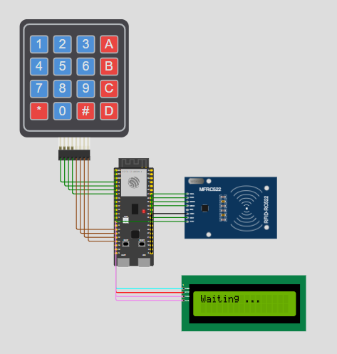
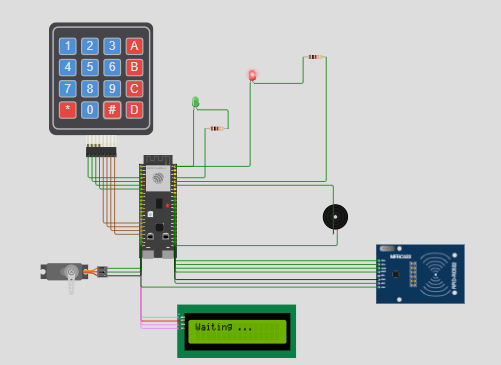
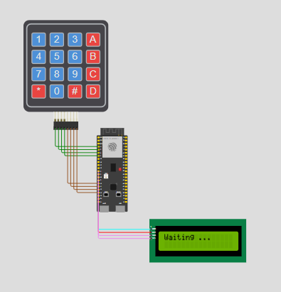
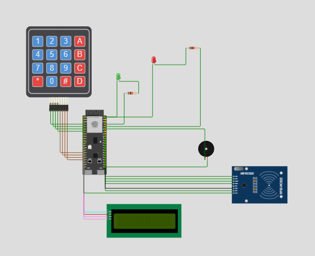

# SmartLock

SmartLock is a connected door-lock system built from ESP32-S3 firmware, an MQTT/OTP/card service, and a Next.js web client.

## Architecture

```text
ESP32-S3 firmware <-> MQTT broker <-> TypeScript server <-> Next.js client
```

- `src/`: PlatformIO firmware for the ESP32-S3.
- `server/`: MQTT service, card store, OTP service, and email notifiers.
- `client/`: Next.js card-management interface.
- `diagram.json`: Wokwi circuit definition.
- `wokwi.toml`: firmware and ELF paths used by Wokwi.

GitNexus currently indexes the repository with `590 nodes`, `1,116 edges`, `36 clusters`, and `16 execution flows`.


## Hardware

The project targets `esp32-s3-devkitc-1`.

| Device | GPIO |
| --- | --- |
| Keypad rows | 4, 5, 6, 7 |
| Keypad columns | 10, 11, 12, 13 |
| LCD I2C SDA/SCL | 8, 9 |
| RFID SS/RST | 40, 35 |
| RFID SCK/MISO/MOSI | 39, 36, 38 |
| Green/red LEDs | 1, 2 |
| Buzzer | 42 |
| Servo | 14 |

The servo uses native Arduino-ESP32 LEDC PWM at 50 Hz. The ESP32-S3 supports a maximum LEDC resolution of 14 bits.

### Devices and wiring

The following connections are taken directly from `diagram.json`:

| Device | Device pins | ESP32-S3 connection | Function |
| --- | --- | --- | --- |
| 4x4 keypad | `R1-R4` | GPIO `4, 5, 6, 7` | Key-scan rows |
| 4x4 keypad | `C1-C4` | GPIO `10, 11, 12, 13` | Key-scan columns |
| I2C LCD1602 | `SDA`, `SCL` | GPIO `8`, `9` | Status, OTP, and user messages |
| I2C LCD1602 | `VCC`, `GND` | `5V`, `GND.1` | LCD power |
| MFRC522 | `SDA/SS`, `SCK`, `MOSI`, `MISO` | GPIO `40, 39, 38, 36` | SPI and RFID chip select |
| MFRC522 | `RST` | GPIO `35` | RFID module reset |
| MFRC522 | `3.3V`, `GND` | `3V3.1`, `GND.4` | MFRC522 power |
| Green LED | Anode through `1 kOhm` resistor | GPIO `1` | Locked/ready indicator |
| Red LED | Anode through `1 kOhm` resistor | GPIO `2` | Access-denied indicator |
| Green/red LEDs | Cathodes | `GND.2` | LED return path |
| Buzzer | Signal pin | GPIO `42` | Access and error sounds |
| Buzzer | Return pin | `GND.4` | Buzzer return path |
| Servo | `PWM` | GPIO `14` | Lock/unlock position control |
| Servo | `V+`, `GND` | `5V`, `GND.1` | Servo power and ground |

The keypad, LEDs, buzzer, and servo are controlled directly through GPIO. The LCD uses I2C and the MFRC522 uses SPI. In the diagram, the MFRC522 pin named `SDA` is its SPI `SS`/chip-select pin, not the I2C SDA line.

### RFID



### Servo



### LCD and OTP



### LEDs and buzzer



## MQTT topics

The default device ID is `esp32-01`. The topic hierarchy is:

```text
smartlock/device/{deviceId}/{resource}/{operation}
```

In MQTT, publishers send messages to a concrete topic name, while subscribers use a topic filter. This project uses the `+` single-level wildcard on the server so one server can handle requests from multiple device IDs. Wildcards are valid for subscriptions, not for publishing.

| Topic | Direction | Publisher | Subscriber | Payload | Purpose |
| --- | --- | --- | --- | --- | --- |
| `smartlock/device/{id}/otp/request` | Device -> server | ESP32 | Server | `1` | Request a new OTP after the master-password flow |
| `smartlock/device/{id}/otp` | Server -> device | Server | ESP32 | 6-digit OTP string | Deliver an OTP to the requesting device |
| `smartlock/device/{id}/card/enroll` | Device -> server | ESP32 | Server | RFID UID string | Add a card to the server card store |
| `smartlock/device/{id}/card/enroll/result` | Server -> device | Server | ESP32 | `ok` or `duplicate` | Report card-enrollment status |
| `smartlock/device/{id}/card/verify` | Device -> server | ESP32 | Server | RFID UID string | Check whether a card is registered |
| `smartlock/device/{id}/card/verify/result` | Server -> device | Server | ESP32 | `valid` or `invalid` | Report card-verification status |

### Subscription filters

The server subscribes using these filters so it can serve any device ID:

```text
smartlock/device/+/otp/request
smartlock/device/+/card/enroll
smartlock/device/+/card/verify
```

The ESP32 subscribes to concrete device-specific result topics. For example, it listens to `smartlock/device/esp32-01/card/verify/result`, not to a wildcard.

### Topic design notes

- Topic levels are separated with `/` and are case-sensitive.
- Keep the device ID in the topic so routing and access control can be device-specific.
- Use exact topics when publishing; do not publish to `+` or `#` filters.
- Keep request and result topics separate so each message has one clear meaning.
- The server extracts `{deviceId}` from the third topic level before issuing OTPs or publishing results.

The topic hierarchy follows the MQTT topic and wildcard guidance from [HiveMQ MQTT Essentials: Topics, Wildcards, and Best Practices](https://www.hivemq.com/blog/mqtt-essentials-part-5-mqtt-topics-best-practices/).

## Firmware

Build from the repository root:

```bash
pio run
```

The firmware image is generated at `.pio/build/esp32-s3-devkitc-1/firmware.bin`.

For Wokwi, use:

```bash
wokwi-cli
```

or open the project in Wokwi using the paths configured in `wokwi.toml`.

The main firmware initialization sequence is:

1. Initialize the keypad and LCD.
2. Connect to MQTT.
3. Initialize RFID, indicators, and the servo.
4. Enter `IdleState`.
5. Poll RFID and keypad input in `loop()`.

### Firmware libraries

The firmware dependencies declared in `platformio.ini` are:

| Dependency | Role |
| --- | --- |
| `chris--a/Keypad@^3.1.1` | Scans the 4x4 keypad matrix and returns pressed keys |
| `marcoschwartz/LiquidCrystal_I2C@^1.1.4` | Drives the LCD1602 over I2C |
| `knolleary/PubSubClient` | Provides MQTT connect, subscribe, and publish operations |
| `miguelbalboa/MFRC522@^1.4.11` | Reads RFID UIDs and communicates with MFRC522 over SPI |
| `bblanchon/ArduinoJson@^7.0.0` | Parses and generates structured JSON payloads |

The servo uses the Arduino-ESP32 LEDC API, so no external servo library is required. This avoids the legacy MCPWM path used by `ESP32Servo` on ESP32-S3/Wokwi.

`PubSubClient` is an Arduino MQTT client that supports ESP32. Its upstream documentation notes that it publishes at QoS 0, subscribes at QoS 0 or 1, and uses a 256-byte default packet buffer. The project currently sends short text payloads, so these defaults are sufficient. See the [PubSubClient documentation](https://github.com/knolleary/pubsubclient).

## Server

```bash
cd server
pnpm install
pnpm run dev
```

Build production:

```bash
pnpm run build
pnpm start
```

The server reads configuration from environment variables and uses the MQTT broker at `host.wokwi.internal:1883` in Wokwi.

## Client

```bash
cd client
pnpm install
pnpm dev
```

Other commands:

```bash
pnpm run build
pnpm run start
pnpm run lint
```

## Authentication flow

1. The user scans an RFID card.
2. The ESP32 publishes the UID to the `card/verify` topic.
3. The server returns the verification result.
4. If the card is valid, the server sends an OTP.
5. The user enters the OTP on the keypad.
6. The ESP32 unlocks the servo for the configured delay.
7. When the controller returns to `IdleState`, the door locks again.

Card enrollment uses the default master password in `src/config/AppConfig.h`. Do not use the default value in production.

## GitNexus

Check the GitNexus index status:

```bash
node .gitnexus/run.cjs status
```

Refresh the index after major changes:

```bash
node .gitnexus/run.cjs analyze --index-only
```

Analyze impact before changing a symbol:

```bash
node .gitnexus/run.cjs impact "SymbolName" --direction upstream --repo .
```

Analyze the current changes before committing:

```bash
node .gitnexus/run.cjs detect-changes --scope all --repo .
```

## External references

- [HiveMQ MQTT Essentials: Topics, Wildcards, and Best Practices](https://www.hivemq.com/blog/mqtt-essentials-part-5-mqtt-topics-best-practices/) — topic hierarchy, topic filters, `+`/`#` wildcards, and naming guidance.
- [PubSubClient on GitHub](https://github.com/knolleary/pubsubclient) — Arduino MQTT client capabilities, supported hardware, QoS behavior, and packet-size defaults.
